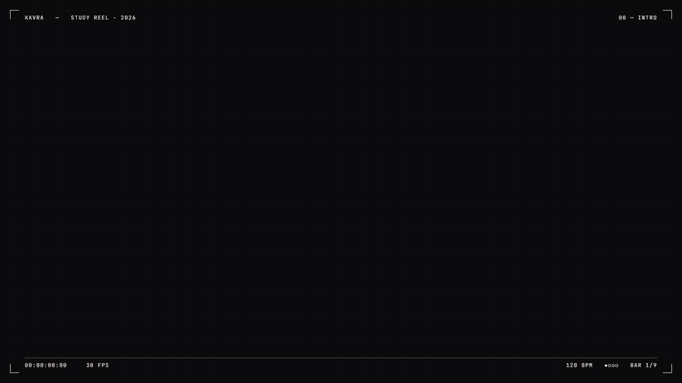

# kavra



**An AI study partner for university courses.** It aims for two things: **the highest grade you
can get on the exam** and **understanding that lasts after it.** Works with Claude Code, Codex and
Antigravity, and uses your Obsidian vault as the textbook.

*kavra* is Turkish for "grasp".

> Türkçe: [README.tr.md](README.tr.md)

## What it does

- **Asks your goal first, then probes.** Whole topic or tomorrow's quiz? Then graded questions find
  exactly where your knowledge ends.
- **Plans, then waits for your OK.** The topic becomes a small dependency map: undisputed basics at
  the top, your goal at the bottom. No teaching starts until you approve it.
- **Teaches step by step.** Each step: why it's needed → build it → connect it to the last step →
  check with one question. You try first. No ready answers, just a hint ladder.
- **Switches explanation when you're stuck.** If something doesn't land in two tries, it doesn't
  repeat the same sentences. It moves to an analogy, a box table, a drawing or a visualizer.
- **You pick the sources.** Slides, textbook, lecture videos, your notes, past exams. You decide
  which one the exam comes from and which wins on conflict. It cites where: slide number, page,
  video timestamp.
- **Exam mode.** Ranks topics by weight × weakness and suggests an order; you decide. Writes new
  questions in your professor's style and grades open answers as strictly as they would.
- **Spaced review.** Every topic leaves dated review questions (1-3-7-14-30 days). Every session
  starts with what's due.
- **Everything lands in your vault.** One Markdown file per topic: map, questions, your answers,
  where you left off. Start in Claude Code, continue in Codex; the files are the handoff.

It talks in your language (set in `learner.md`). It was built and tested in Turkish.

## Install

### Claude Code plugin

```
/plugin marketplace add zekierman/kavra
/plugin install kavra@kavra
```

### Codex, Antigravity, or manual

Copy the skill into your Obsidian vault so it's active only there:

```bash
git clone https://github.com/zekierman/kavra
cd <your-vault>
mkdir -p .claude/skills .agents/skills
cp -r <clone>/skills/kavra .claude/skills/     # Claude Code
cp -r <clone>/skills/kavra .agents/skills/     # Codex + Antigravity
```

On Windows PowerShell use `Copy-Item -Recurse` instead of `cp -r`. For every project, use the
global paths: Claude Code `~/.claude/skills/`, Codex `~/.agents/skills/`.

### With Avenox Beyin (second brain)

[Avenox Beyin](https://github.com/avenoxai/avenoxbeyin) adds persistent memory across sessions and
agents. kavra studies on top of it, so "where did we leave off yesterday?" has an answer in any
agent.

1. Install Avenox Beyin with its **official installer**: give your agent
   [avenox.lol/beyin.md](https://avenox.lol/beyin.md) and say "read and install". This repo does
   not contain its code.
2. Import kavra with the brain's skill command, from the vault root:

   ```bash
   git clone https://github.com/zekierman/kavra
   python3 beyin.py skill-import --source <clone>/skills/kavra     # Windows: py -3 beyin.py ...
   python3 beyin.py doctor
   ```

3. Open your agent in the vault and say "let's study". kavra puts courses in the projects folder,
   reads the brain's identity and rules files as your preferences, and at the end of a session
   writes a one-line status (topic, next step, reviews due) to the active threads file.

> Old (v2) Avenox installs have no `beyin.py`. Copy manually as above.

### First run

Say "let's study linked lists from Data Structures". The first time, it asks where courses live and
what you study from, then creates your `learner.md` profile. The profile is yours: write how you
learn and what you dislike; kavra reads it every session. To check the setup: "kavra check".

## In your vault

```
Courses/
├── learner.md            # your profile
└── Data Structures/
    ├── _course.md        # sources, exams, topic map, mistake log, review queue
    └── linked-list.md    # map, where you are, sessions
```

The terminal is the classroom, Obsidian is the textbook. Keep the lesson file open next to the
terminal; the map, LaTeX and progress fill in live. Ask for a worksheet and answers come hidden in
collapsible callouts, so you can solve on paper and check yourself.

## Limits

- Agents can't watch videos. Video sources need subtitles or your own notes.
- Lesson files aren't locked. Don't run two agents on the same course at once.
- Brain integration follows the brain's settings: if memory is off or manual, kavra doesn't write
  there.
- Early release, tested on real course sessions. Found a bug? Open an issue.

## Why it works this way

Every rule rests on a research finding:

- **Self-testing and spreading practice over time** came out as the two most effective of ten
  study techniques reviewed. So kavra doesn't replace your own method; it adds testing and review
  on top. ([Dunlosky et al., 2013](https://journals.sagepub.com/doi/abs/10.1177/1529100612453266))
- **AI that gives answers hurts learning.** In an experiment with about 1,000 high school students,
  plain GPT-4 raised practice scores, but students did worse once the AI was taken away. A version
  that gave hints instead of answers reduced that harm. So kavra hints, it doesn't answer.
  ([Bastani et al., PNAS 2025](https://www.pnas.org/doi/10.1073/pnas.2422633122))
- **A well-designed AI tutor can beat the classroom.** At Harvard, a tutor that kept replies short,
  revealed one step at a time, had students try first and had correct solutions prepared in advance
  produced more than twice the gains of an active-learning class. kavra follows the same rules:
  short messages, one step, you try first, verify the answer from the source before asking.
  ([Kestin et al., Scientific Reports 2025](https://www.nature.com/articles/s41598-025-97652-6))
- **Trying first helps, even when you're wrong.** Guessing at something you don't know and then
  getting corrected teaches better than just reading. Confident errors that get corrected stick
  especially well.
  ([review on learning from errors](https://link.springer.com/article/10.3758/s13423-021-02022-8),
  [hypercorrection effect](https://www.researchgate.net/publication/11641193_Errors_Committed_with_High_Confidence_Are_Hypercorrected))
- **Worked examples first, then fade them.** Beginners learn faster from worked examples. As they
  gain skill the effect reverses, so steps are gradually left blank.
  ([worked-example effect](https://en.wikipedia.org/wiki/Worked-example_effect),
  [expertise reversal effect](https://en.wikipedia.org/wiki/Expertise_reversal_effect))
- **Active learning, cognitive load, adapting to the learner, curiosity, metacognition.** Google's
  education model LearnLM follows the same five principles.
  ([Google](https://blog.google/products-and-platforms/products/education/google-learnlm-gemini-generative-ai/))

## Credits

- Second brain: [Avenox Beyin](https://github.com/avenoxai/avenoxbeyin) (MIT). kavra doesn't
  include its code; it's added on top through the official import path.
- Teaching principles ("undisputed truths first", "how would I have discovered this?",
  probe → plan → teach) adapted from [amosblomqvist/learn](https://github.com/amosblomqvist/learn),
  written for the `pi` agent. kavra is an independent, exam-focused rewrite for Claude Code, Codex
  and Antigravity.

## License

MIT
