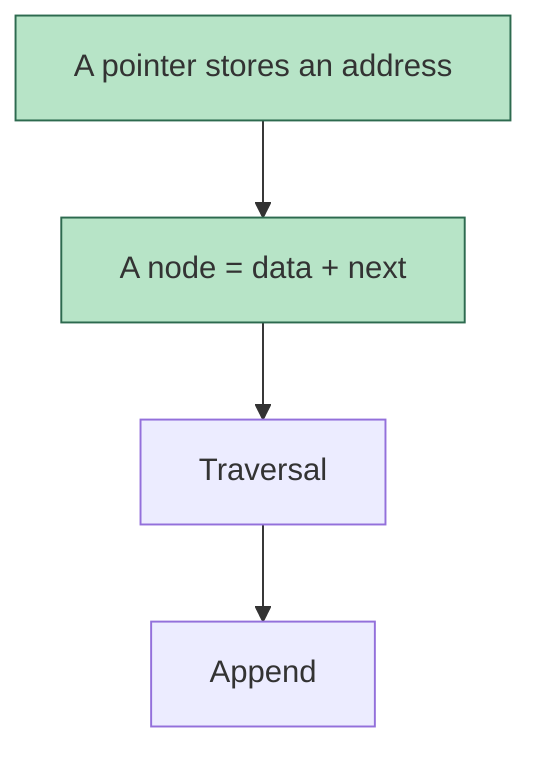

# Lesson files

Plain markdown, rendered in Obsidian. Every agent reads and writes the same files, so keep to these
formats — they are how a session started in one tool resumes in another.

## Rules that keep shared files intact

- **Re-read a file right before editing it** — another agent may have written since. Edit sections in
  place; don't rewrite whole files.
- **Headings are in the learner's language, chosen once.** When creating a course, translate the
  section headings below into the learner's language (table at the end). After that, **reuse the exact
  headings already in the file** — find a section by its role, never add a second section with the
  same role in another language or wording.
- Keep the table columns as they are; other agents parse them.
- Get today's date from the system before any date math.

## Layout

```
<courses root>/
├── learner.md
└── <Course>/
    ├── _course.md
    ├── <topic>.md
    └── <topic>.md
```

Use the course name the learner uses. Topic files are named by topic, not by date
(`linked-lists.md`, not `week3.md`) — one topic grows across many sessions.

## `_course.md`

```markdown
---
course: Data Structures
code: CS201
instructor: <name>
exams:
  - {name: Midterm, date: 2026-11-10, weight: 40}
  - {name: Final, date: 2027-01-12, weight: 60}
sources:            # set by the learner; listed in priority order (first wins a conflict)
  - {type: slides, where: path/to/slides/, exam: yes}
  - {type: book, where: "Weiss, Data Structures, ch. 3", exam: yes}
  - {type: video, where: "https://youtube.com/playlist?list=…", exam: no, note: "no transcript; use my notes"}
  - {type: notes, where: path/to/my-notes/, exam: yes}
  - {type: past-exams, where: path/to/past-exams/, exam: yes}
---

# Data Structures

## Topic map
| Topic | Exam | Weight | Status | Last reviewed |
| --- | --- | --- | --- | --- |
| [linked-lists](linked-lists.md) | Midterm | high | shaky | 2026-09-27 |
| [stacks](stacks.md) | Midterm | medium | not started | |

Status, with the evidence each one needs:
- **not started**
- **shaky** — taught, but some check questions missed or not yet produced unaided.
- **solid** — every node checked, at least one produce task (explain / trace / code) done, and a
  transfer problem solved without help.
- **exam-ready** — solid, plus at least one successful spaced review and exam-style questions
  answered under exam conditions.

Weight (low / medium / high, or points) comes from exam intel. Use standard markdown links — Obsidian resolves them and so can every agent.

## Exam intel
- Format: <classic / multiple choice / code on paper / mixed>, <duration>
- Instructor's style: <what past exams and class hints show — favourite question types, what they
  penalize, "this will be on the exam" moments, with dates>

## Error log
| Date | Topic | Mistake | Type |
| --- | --- | --- | --- |
Types: gap (didn't know) · misconception (knew it wrong) · misread · careless · time.

## Review queue
| Topic | Prompt | Next | Step |
| --- | --- | --- | --- |
| linked-lists | What exactly does `p = p->next` change? | 2026-09-28 | 0 |
```

## `<topic>.md`

````markdown
---
course: Data Structures
topic: Linked lists
sources: [slides week 3 p.4-22, book ch. 3.2]
---

# Linked lists

## Map


## Frontier
- Solid: nodes, pointer vs node, malloc
- Shaky: why append needs a pointer to the last node
- Next: append with a tail pointer

## Session 2026-09-27
<lesson prose, as taught>

**Q3.** <question>
- A) …  B) …  C) …  D) I don't know
- → B ✗ · correct: C · <feedback>
````

Always quote mermaid labels (`B["A node = data + next"]`) — `=`, `()`, `<`, `->` break unquoted labels.
Mark finished nodes by rewriting the single `class … done` line with the full list of done node ids —
the learner sees progress fill in.

## Review schedule

Review items live in **one queue per course**, `## Review queue` in `_course.md`, so a single read
shows everything due. They are **recall prompts**, not facts: a question the learner answers from
memory. Write 2–5 per topic, aimed at the ideas the rest of the topic hangs on and at anything they
missed.

Intervals by `Step`: 0 → +1 day, 1 → +3, 2 → +7, 3 → +14, 4 → +30, then `Step` = done and `Next`
empty (keep the row as a record). If an exam that covers it is still ahead, instead keep `Step` 4
and set `Next` = +60 days.

- Recalled correctly → `Step` +1, `Next` = today + interval of the new step.
- Missed → `Step` = 0, `Next` = tomorrow, and log it in `_course.md` → Error log.
- One row per concept: if a new miss matches an existing prompt, reset that row instead of adding a
  duplicate (the error log keeps the history).

A review is **due** when `Next` ≤ today.

## Headings in Turkish

Use these when `learner.md` says Turkish; for other languages, translate once and keep them stable.

| Role | English | Türkçe |
| --- | --- | --- |
| topic map | Topic map | Konu haritası |
| exam intel | Exam intel | Sınav bilgisi |
| error log | Error log | Hata günlüğü |
| review queue | Review queue | Tekrar kuyruğu |
| dependency map | Map | Harita |
| frontier | Frontier | Neredeyim |
| session | Session YYYY-MM-DD | Oturum YYYY-MM-DD |
| review table columns | Topic / Prompt / Next / Step | Konu / Soru / Sonraki / Adım |

