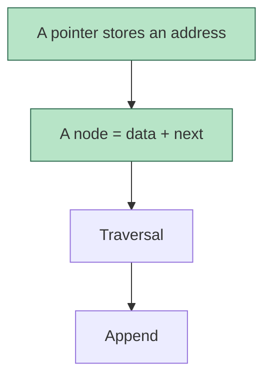

# Lesson files

Plain markdown, rendered in Obsidian. Every agent reads and writes the same files, so keep to these
formats — they are how a session started in one tool resumes in another.

## Layout

```
<courses root>/
├── learner.md
└── <Course>/
    ├── _course.md
    ├── <topic>.md
    └── <topic>.md
```

Use the course name the learner uses. Topic files are named by topic, not by date
(`linked-lists.md`, not `week3.md`) — one topic grows across many sessions.

## `_course.md`

```markdown
---
course: Data Structures
code: CS201
instructor: <name>
exams:
  - {name: Midterm, date: 2026-11-10, weight: 40}
  - {name: Final, date: 2027-01-12, weight: 60}
sources:
  - path/to/slides/
  - path/to/past-exams/
---

# Data Structures

## Topic map
| Topic | Exam | Status | Last reviewed |
| --- | --- | --- | --- |
| [[linked-lists]] | Midterm | shaky | 2026-09-27 |
| [[stacks]] | Midterm | not started | |

Status is one of: not started · shaky · solid · exam-ready.

## Exam intel
- Format: <classic / multiple choice / code on paper / mixed>, <duration>
- Instructor's style: <what past exams and class hints show — favourite question types, what they
  penalize, "this will be on the exam" moments, with dates>

## Error log
| Date | Topic | Mistake | Type |
| --- | --- | --- | --- |
Types: gap (didn't know) · misconception (knew it wrong) · misread · careless · time.
```

## `<topic>.md`

````markdown
---
course: Data Structures
topic: Linked lists
sources: [slides week 3 p.4-22]
---

# Linked lists

## Map


## Frontier
- Solid: nodes, pointer vs node, malloc
- Shaky: why append needs a pointer to the last node
- Next: append with a tail pointer

## Session 2026-09-27
<lesson prose, as taught>

**Q3.** <question>
- A) …
- B) …
- C) …
- D) I don't know

→ Answered B ✗. Correct: C. <feedback>

## Review
| Prompt | Next | Step |
| --- | --- | --- |
| What exactly does `p = p->next` change? | 2026-09-28 | 0 |
````

Mark finished map nodes by adding them to the `class … done` line — the learner sees progress fill in.

## Review schedule

Review items are **recall prompts**, not facts: a question the learner answers from memory. Write 2–5
per topic, aimed at the ideas the rest of the topic hangs on and at anything they missed.

Intervals by `Step`: 0 → +1 day, 1 → +3, 2 → +7, 3 → +14, 4 → +30, then done (drop the row, or keep
it at +60 if an exam is still ahead).

- Recalled correctly → `Step` +1, `Next` = today + interval of the new step.
- Missed → `Step` = 0, `Next` = tomorrow, and log it in `_course.md` → Error log.

A review is **due** when `Next` ≤ today. At session start, check every lesson file's `## Review`
table in the course.
